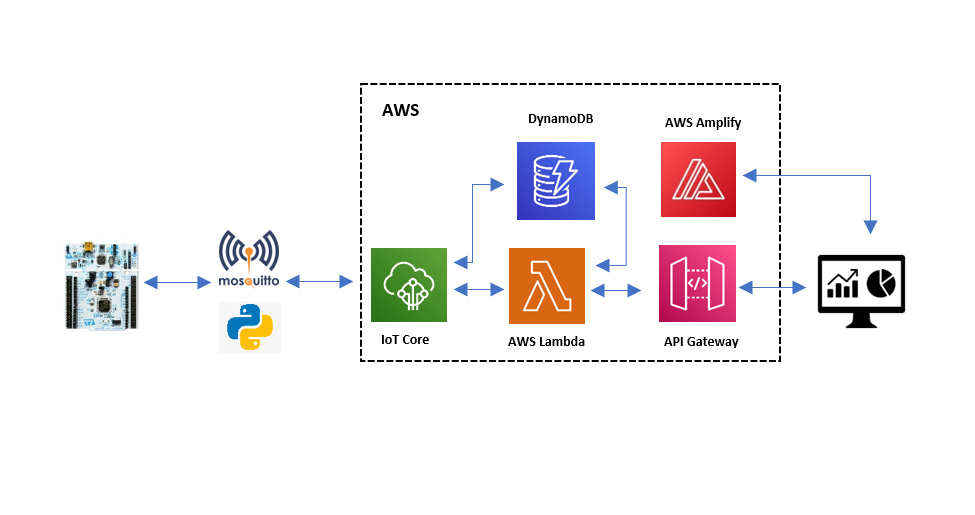
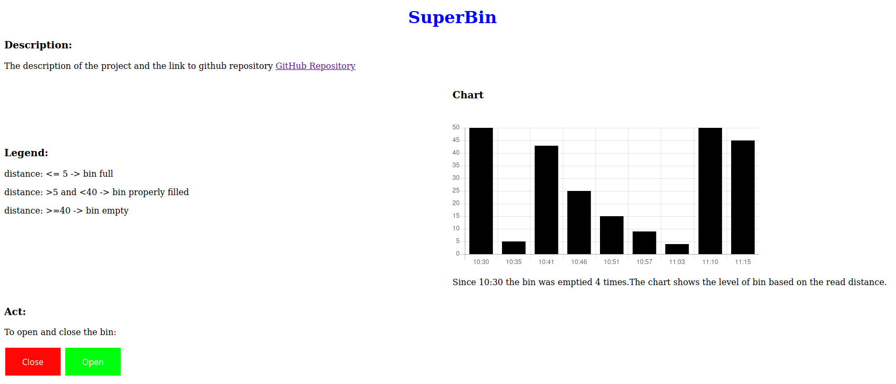
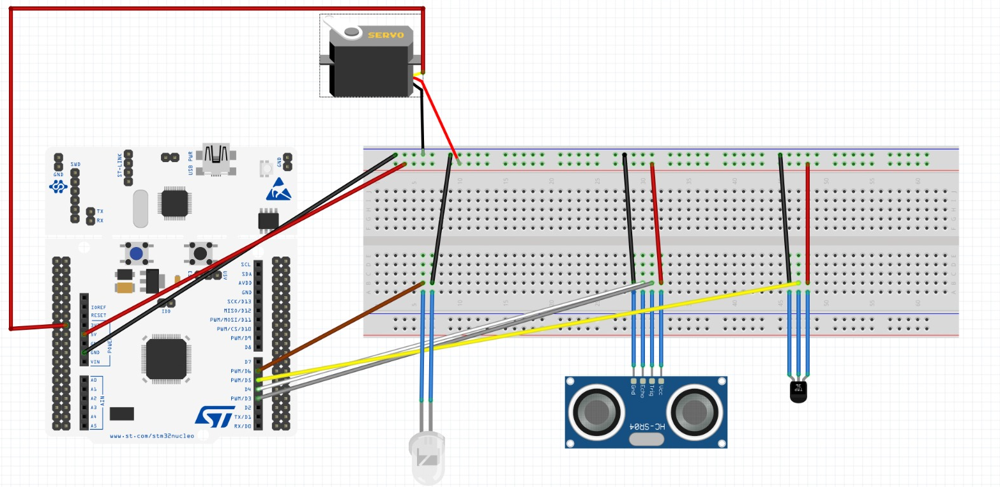
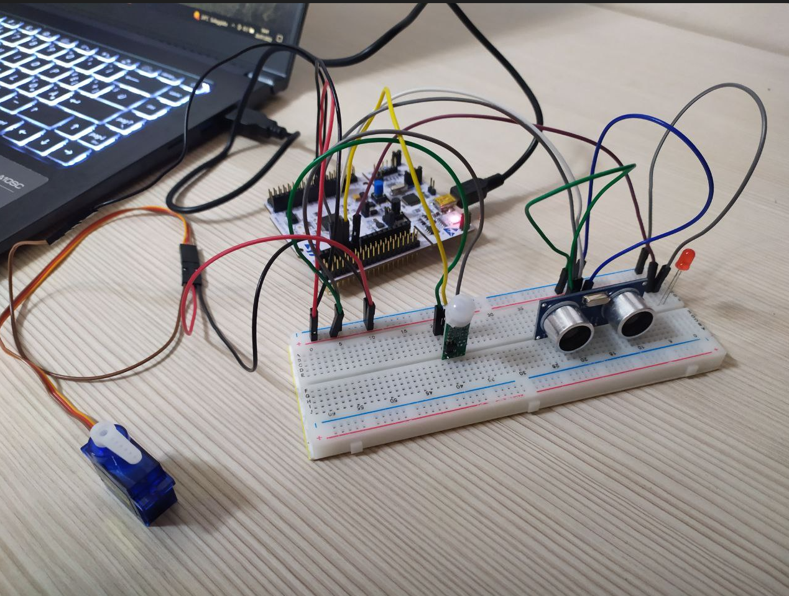
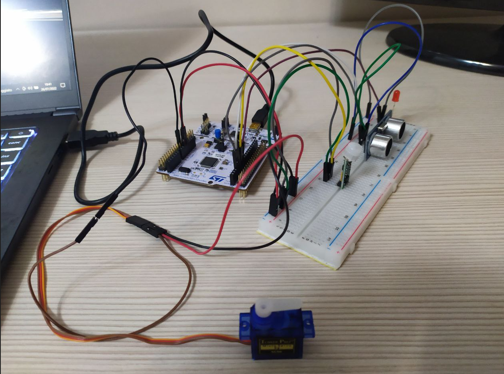
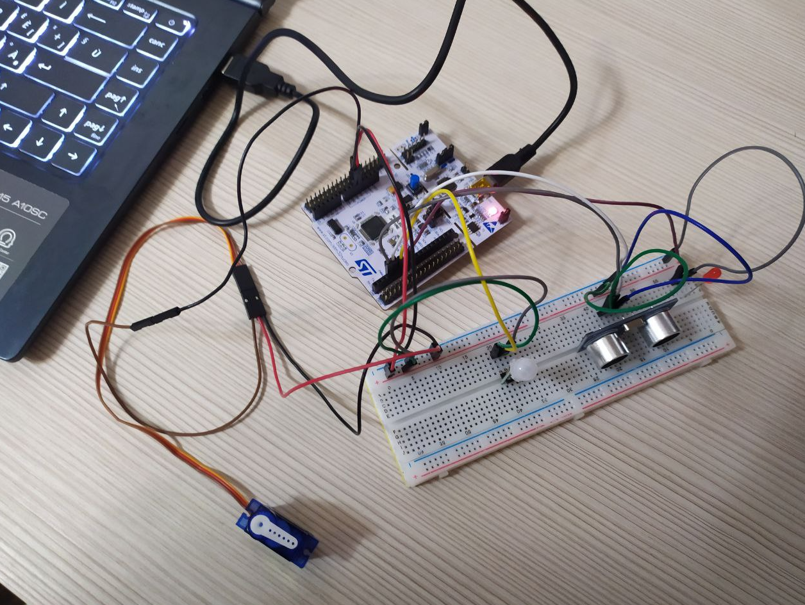

 # Super Bin
This is the individual project for the IoT course 2022 of the master's degree "Engineering in computer science" at the "Sapienza" university.<br>
The idea came from a bet with a friend of mine. He wanted a smart bin for his bar, which would allow him to have the fill level always at hand and also that the bin is able to lift the lid when passing the hand over it so that a person could throw something out. To solve the problem I created a cloud-based IoT system called Super Bin.

## Description of the system

### Sensors
The sensors used are the ultrasonic sensor and the pir sensor.

- #### Ultrasonic Sensor (HC-SR04):
  It is used to measure the bin level. Indeed it is located on the top of the bin and if the distance from the sensors to the trash is smaller and equal to 5 cm the bin will be full,if the distance from the sensors to the trash is included between 5 cm and 40 cm the bin will be properly filled, instead if the distance is greater than 40 the bin will be empty.The distance is measured by sending a trigger signal and receiving an echo signal; the echo time received in us is divided by 58 in order to have the distance value in cm. It can measure distances in the range of 2 cm to 4 m, the ranging accuracy can reach 3 mm and it can be powered by a 5V power supply. ([datasheet](https://www.electroschematics.com/hc-sr04-datasheet/))
- #### PIR sensor (HC-SR505):
  It detects movements. As soon as the hand of the person who intends to throw something is passed over the bin it changes state and the servo motor is activated so that the bin is opened.After 5 seconds if the pir doesn't detect any motions, it changes state and the bin lid is closed by the servo motor.This sensor is always switched on. Specifically, it detects movement within a range of 100° angle and a sensing distance of 3m.([datasheet](https://static.rapidonline.com/pdf/78-4110_v1.pdf))


Since the super bin works at any moment, periodic sensing is done by the ultrasonic sensor every 5 seconds by performing a new measurement.The pir sensor is always switched on and when the hand of the person who intends to throw something in the bin, it changes state by detecting a new motion.


### Actuators
The actuators used in the system are the servo motor and one led.
- #### Servo motor SG90:
  The servo motor is used to open or close the bin. If the pir sensor detects a motion the bin will open in order to throw something in the bin. If any motion is detected the bin will remain closed.([datasheet](https://components101.com/motors/servo-motor-basics-pinout-datasheet))
- #### Led:
    The led is used to indicate when the bin is full. As soon as the distance is smaller than 5 cm the led will be activated.([datasheet](https://www.farnell.com/datasheets/1498852.pdf))

### System Architecture


The sensors and the actuators are connected to an STM nucleo-f401re board and the overall IoT device is developed using the embedded operating system RIOT-OS. The cloud level is developed using AWS.<br>

The IoT device and the cloud system exchange messages through the transparent bridge,a python program based on a publish/subscribe mechanism. The board sends the measures through the Mosquitto broker using the MQTT-SN protocol. The messages are published under the topic “topic_pub” and the board is subscribed to the topic “topic_sub” in order to receive the messages sent from the web dashboard, that are used to close or open the bin.<br>

The distance (indicating the bin level) coming from the board to AWS is stored on DynamoDB by setting a proper rule. The messages are displayed on the web dashboard through the REST API, which activates the lambda function that gets the data from the database. From the web dashboard, it is possible to close or open the bin by publishing the message "close" or the message "open" under the topic “topic_pub” and using another lambda function that allows publishing the message to AWS.<br>

AWS Amplify is an AWS service that allows hosting the web dashboard.<br>

The architecture system is described in the figure below:





## System Logic

The system starts to take measures as soon as the power is given to the device. The ultrasonic sensor measures the distance in order to see how full the bin is and the led gives a feedback whether the bin is full or not. The sensors work in the manner described below:

- when the ultrasonic sensor measures a distance smaller and equal than 5 cm, the led is turned on and the bin will be full;
- when the distance measured is between 5 cm and 40 cm, the led is switched off and the bin level will be normal;
- when the distance measured is greater than 40 cm, the led is switched off  meaning that the bin will be empty.

Instead, when the pir sensor detects a motion, the servo motor will be activated and will open the bin. Otherwise whether after 5 seconds any motion is detected the bin will be closed.the bin will remain opened and the led will be activated when the bin is full. In that case, as soon as the bin will be emptied the system will start working properly again.The distance measured by the ultrasonic sensor(rappresenting the bin level) is displayed on the web dashboard. From the last one, the user can see the level of bin based on the legend also located in the dashboard.Moreover,there are two botton that allows to open and close the bin. An image of the web dashboard is attached below:<br>




## Network performance


In order To measure the latency I have used the prototype. The latency measured to send the value of the distance taken by the ultarsonic sensor to the web dashboard is about 2 seconds. Instead, the latency measured from the dashboard, when the user wants to close or open the bin is about 1,5 seconds.The size of messages coming from the device to the dashboard under the topic "topic_pub" is 3 bytes and the size of messages from the dashboard to the device under the topic "topic_sub" is 6 bytes. We can infer that the volume of data trasmitted over the network is 9 bytes.

## System setup and start-up

These are all the steps you need to do to run and enjoy the system.
- ### Cloud level
  - ***Iot Core***:<br>
  Create a new thing on the iot core service. Before finishing the creation download the certificate kit that will be needed later for communication between device and aws. At the end, go to Security -> Policies and edit the active policy for thr created thing.Edit the current policy using the JSON format, put as " policy effect -> Allow ", " policy action -> Iot:* " e " policy resorce ->* ".After that, select the policy as active version and click on button "save as a new version".Then go to Message Routing -> Rules and create a new rule. Set as name"super_bin_rule",edit the rule and in the sql statement put "SELECT message FROM 'topic_pub'".As rule action insert from the list DynamoDB and select the table"measurements". Check if "partition key" is "sample_time", if “partition key type” is “NUMBER” and put "${timestamp()}" as “partition key value”. At the end write “distance” in the box "Write message data to this column",then click on "create rule".<br><br>
 
  - ***DynamoDB***:<br>
   Create a table with the name "measurements", insert "sample_time" in the box "partition key" and put as type "Number".<br><br>
  
  - ***Lambda***:<br>
  Create 2 lambda functions using the Lambda service on AWS.Give the name “get_data_from_db” to one function that allows to get the data from DB and the name “publish_topic” to the other one that allows to store data on the DB.Edit the code of the functions by using the code under "Lambda_Functions" folder. As excution role create a new one with the name "super_bine_role". Then edit the role using the JSON format and put as " policy effect -> Allow ", " policy action -> dynamodb:* " e " policy resorce ->*, then click on "review policy" and "save changes".<br><br>

   - ***API Gateway***:<br>
  Create API by selecting the option "REST API". As name use "superBin_API" and choose "Edge optimized" as "Endpoint Type". Then "Create Method" from the "Action" list. Select POST, then as "integration type" choose lambda function and write in the lambda function box "get_data_from_db".After that, deploy API and go on. Create another API by selecting the option "REST API". As name use "superBin1_API" and choose "Edge optimized" as "Endpoint Type". Then "Create Method" from the "Action" list. Select GET, then as "integration type" choose lambda function and write in the lambda function box "publish_topic". At the end, deploy and the APIs have been created.<br><br>
  
  - ***AWS Amplify***:<br>
  First of whole zip the three file containing in the "Web_App" folder.Use AWS amplify service and create a new app. Use amplify as host for the web app, the select "Deploy without Git Provider" and go on.put the name of the app use the option "Drag and Drop" to upload the folder that you have zipped before. Finally use the link provided by AWS amplify for viewing the web dashboard.
  
  
- ### Device level

  - Clone the [repository](https://github.com/eclipse/mosquitto.rsmb) of mosquitto.Then go to the folder mosquitto.rsmb/rsmb/src and start-up the local broker using the following command:

    ```
    ./broker_mqtts config.conf
    ```
  - Take the file “transparent_bridge.py” on the GitHub repository and  run the python program using the following command:

    ```
    python3 transparent_bridge.py
    ```
  - Connect all the sensors and actuators to the board using the following schema.<br>
    
  

  - Clone the [RIOT repository](https://github.com/RIOT-OS/RIOT) and create a folder "super_bin" using the code provided to "Riot_Code" folder in the repository.Connect the board to the machine and run the following commands:

    ```
    cd
    sudo ./RIOT/dist/tools/tapsetup/tapsetup
    sudo ip a a fec0:affe::1/64 dev tapbr0
    ```
    Finally, from the "super_bin" folder excute the command:

    ```
    make flash term
    ```

## Useful links

[LinkedIn Account](https://www.linkedin.com/in/christian-tedesco/)<br>

[Blog post](https://www.hackster.io/christian27/superbin-94ca5b)<br>

[Web Dashboard](https://dev.dbo3i8uzmi6gi.amplifyapp.com)<br>

## Gallery
 



